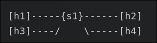
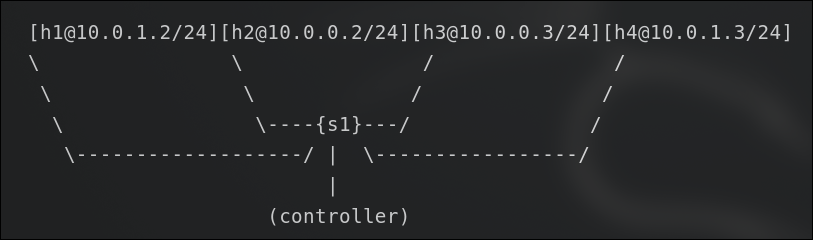
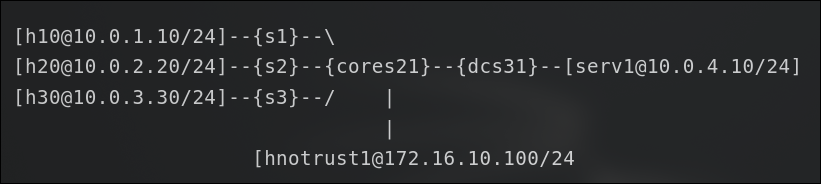

# Programming Mininet Topologies
Mininet is also programmable using the python programming language. We have provided some sample topologies [here](https://courses.cs.washington.edu/courses/cse461/23wi/projects/project2/resources/project2.zip), which should already be downloaded in the VM and unzipped into `~/461_mininet`.

In this directory, you’ll find two different directories: topo and pox. Ignore the pox directory for now (it’s used in part2). In the topo folder there are a variety of python files. These each define a topology for each of the following project portions. Run the project 1 file with sudo python 461_mininet/topos/part1.py. It will drop you into the CLI with the network topology defined in the python script.

# Part 1: Mininet Primer
Your task in part one is to modify part1.py to represent the following network topology:

Where [x] means you create a host named x, {y} means a switch named y, and — means there is a link between the node and the switch.

After creating the above architecture, provide the two items in a part1 folder in a compressed file:
1. Your modified part1.py file
2. Screenshots of the `iperf`, `dump`, and `pingall` commands (from mininet) in pdf format.

# Part 2: SDN Controllers using POX
In part 1, we experimented with Mininet using its internal controller. In this (and future) parts, we will instead be using our own controller to send commands to the switches. We will be using the POX controller, which is written in Python.

For this assignment you will create a simple firewall using OpenFlow-enabled switches. The term “firewall” is derived from building construction: a firewall is a wall you place in buildings to stop a fire from spreading. In the case of networking, it is the act of providing security by not letting specified traffic pass through the firewall. This feature is good for minimizing attack vectors and limiting the network “surface” exposed to attackers. In this part, we will provide you with the Mininet topology, part2.py, to setup your network which assumes a remote controller listening on the default IP address and port number 127.0.0.1:6633. You do not need to (and should not) modify this file. The topology that this script will setup is as follows. Note that h1 and h4 are on the same subnet and a different one from h2 and h3.

For part 2, we will also provide you with a skeleton POX controller: part2controller.py. This file will be where you will make your modifications to create the firewall. To run the controller, place 461_mininet/pox/part2controller.py in the ~/pox/pox/misc directory. You can then launch the controller with the command `sudo ~/pox/pox.py misc.part2controller`. To run the mininet file, place it in ~/ and run the command `sudo python ~/461_mininet/topos/part2.py`.

The rules s1 will need to implement are as follows:

|src ip |	dst ip |	protocol |	action|
|---|---|---|---|
|any ipv4| 	any ipv4 |	icmp |	accept|
|any |	any |	arp |	accept|
|any ipv4 |	any ipv4 |	- 	|drop|

Basically, your Firewall should allow all ARP and ICMP traffic to pass. However, any other type of traffic should be dropped. It as acceptable to flood the allowable traffic out all ports. Be careful! Flow tables match the rule with highest priority first, where priority is established based on the order rules are placed in the table. When you create a rule in the POX controller, you need to also have POX “install” the rule in the switch. This makes it so the switch “remembers” what to do for a few seconds. Do not handle each packet individually inside of the controller! Hint: To do this, look up ofp_flow_mod. The [OpenFlow tutorial](https://github.com/mininet/openflow-tutorial/wiki/Create-a-Learning-Switch#Controller_Choice_POX_Python) (specifically " Sending OpenFlow messages with POX”) and the [POX Wiki](https://noxrepo.github.io/pox-doc/html/) are both useful resources for understanding how to use POX.

**Deliverables:**
1. (10 Points) A screenshot of the `pingall` command. Note that h1 and h4 should be able to ping each other (h2 and h3 as well), but not across subnets. Also, the `iperf` command should fail (as you’re blocking IP traffic). This is realized as the command hanging.
2. (20 Points) A screenshot of the output of the `dpctl dump-flows` command. This should contain all of the rules you’ve inserted into your switch.
3. Your `part2controller.py` file.

# Part 3: A more complex network
In part 2 you implemented a simple firewall that allowed ICMP packets, but blocked all other packets. For your part 3, you will be expanding on this to implement L3 routing between subnets, and implementing firewalls for certain subnets. The idea is to simulate a more realistic network.

We will be simulating a network for a small company. The company has a 3 floor building, with each floor having its own switch and subnet. Additionally, we have a switch and subnet for all the servers in the data center in the basement, and a core switch connecting everything together. Note that the names and IPs are not to be changed. As with prior parts, we have provided the topology (461_mininet/topos/part3.py) as well as a skeleton controller (461_mininet/pox/part3controller.py). As with part 2, you need only modify the controller.

Your goal will be to allow traffic to be transmitted between all the authorized hosts in the company. In this assignment, you will be allowed to flood traffic on the secondary routers (s1,s2,s3,dcs31) in the same method that you did in part2 (using a destination port of of.OFPP_FLOOD). However, in the core router (cores21) you will need to specify specific ports for all IP traffic. You may do this however you choose– however, you may find it easiest to determine the correct destination port and drop/allow action by using the destination IP address and source IP address, as well as the source port on the switch that the packet originated from.

While all authorized hosts should be able to communicate between themselves and the datacenter server, we need to protect the network from the untrusted Internet. In this scenario we represent the external hosts by hnotrust1, and have the following requirements:
1. We need to block all IP traffic from hnotrust1 to serv1, while still allowing the regular hosts (h10, h20, etc.) to communicate with hnotrust1.
2. To block the Internet from discovering our internal IP addresses, we want to block all ICMP traffic from hnotrust1 to the regular hosts (h10, h20, etc.) and serv1.

In summary of your goals: Create a Pox controller (as per part 2) with the following features: All nodes able to communicate EXCEPT
- hnotrust1 cannot send ICMP traffic to h10, h20, h30, or serv1 (but should be able to send IP traffic).
- hnotrust1 cannot send any IP traffic to serv1.

Deliverables:
1. A screenshot of the `pingall` command. All nodes but hnotrust should be able to send and respond to pings.
2. A screenshot of the `iperf hnotrust1 h10` and `iperf h10 serv1` commands. Though not shown in these commands, hnotrust1 should not be able to transfer to serv1. It should be able to transfer to other hosts.
3. A screenshot of the output of the `dpctl dump-flows` command. This should contain all of the rules you’ve inserted into your switches.
4. Your `part3controller.py` file.

# Part 4: A learning router
For part 4, we’ll extend your part 3 code to implement a more realistic level-3 router out of the cores21 switch. The part4controller.py skeleton is very similar to part3, and you may want to begin by copying forward some of your functionality from part3. For the topology, we again provide a file (part4.py). The difference between part3.py and part4.py topologies is that there is no longer a static L3<–>L2 address mapping loaded into each host, and the default route 'h{N}0-eth0' was changed to 'via 10.0.{N}.1' where ‘10.0.{N}.1’ is the IP address of the gateway (i.e. router) for that particular subnet. This effectively changes the network from a switched network (with hosts sending to a MAC address) into a routed network (hosts sending to an IP address which may require a gateway out of the L2 network). A minimal part3controller will not work on this new topology!

To handle this L2<–>L3 mapping cores21 will need to:
- Handle ARP traffic in multiple subnets (without forwarding);
- Generate valid ARP replies when needed; and
- Forward IP traffic across link domains (which will require updating the L2 header);

Additionally, this assignment requires that your implementation work dynamically. You may not install static routes on cores21 at startup. Instead, your router must learn which ports and which L2 addresses correspond to particular L3 addresses, and install the appropriate rules into the cores21 switch dynamically. This information can be inferred by processing the content of received ARP messages, or possibly other traffic on the network (although processing ARP is sufficient). You may handle each of the individual ARP packets in the controller (i.e., not with flow rules) for part 4, but most IP traffic should be handled with flow rules for efficiency. The other switches (e.g., s1) do not need to be modified and can continue to flood traffic with static rules.

Your implementation should still apply the same L3 policy rules from part 3, particularly that:
1. We need to block all IP traffic from the hnotrust1 subnet to serv1, while still allowing the regular hosts (h10, h20, etc.) to communicate with hnotrust1.
2. To block the Internet from discovering our internal IP addresses, we want to block all ICMP traffic from the hnotrust1 subnet to both the regular hosts (h10, h20, etc.) and serv1.

> Note: Combining learning with L3 policies like this is not very secure in practice, since in the real world there is no way to validate the L3 source address with plain IP. Do not naively take the approach used in this assignment and apply it in a production network.

In summary, your complete implementation should:

- Handle ARP traffic in multiple subnets (without forwarding)
- Generate valid ARP replies when needed
- Forward IP traffic across L2 networks as well as within them (which may require updating the L2 header)
- Dynamically learn the L3 topology of the network (which subnets are accessible on which ports) via snooping ARP traffic (or another method)
- Allow all hosts to bidirectionally communicate with the server and with each other after the destination addresses have been learned
- Prevent hnotrust1 from sending IP traffic to serv1
- Prevent hnotrust1 from sending ICMP to any of the regular hosts (h10, h20, etc.) or serv1
- Allow bidirectional IP communication between regular hosts (h10, h20, etc.) and hnotrust1

Deliverables:
1. A screenshot of the pingall command. All nodes but hnotrust should be able to send and respond to pings. Note that some pings will fail as the router learns of routes (why would that be the case?)
2. A screenshot of the iperf hnotrust1 h10 and iperf h10 serv1 commands. hnotrust should not be able to transfer to serv1, but should be able to transfer to other hosts
3. A screenshot of the output of the dpctl dump-flows command. This should contain all of the rules you’ve inserted into your switches.
4. Your part4controller.py file.
